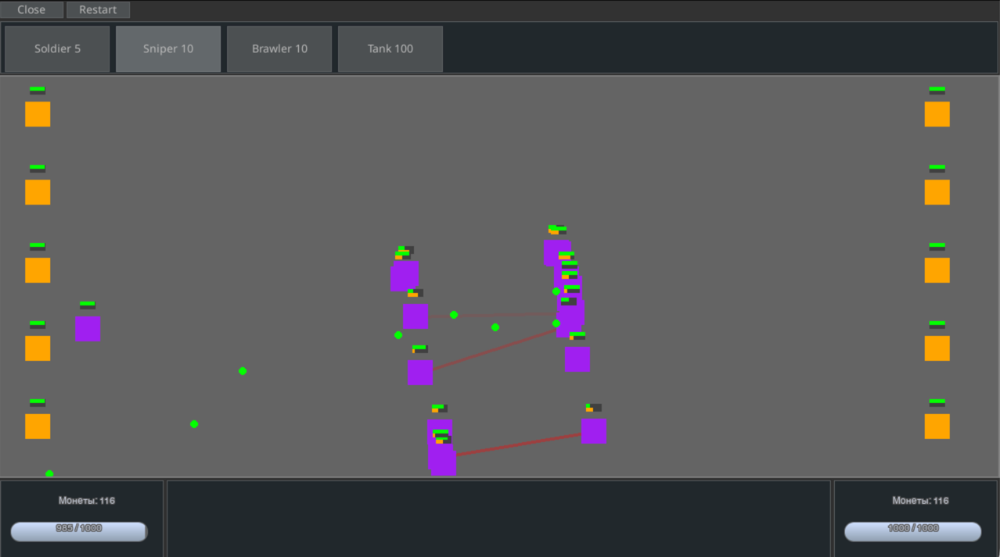
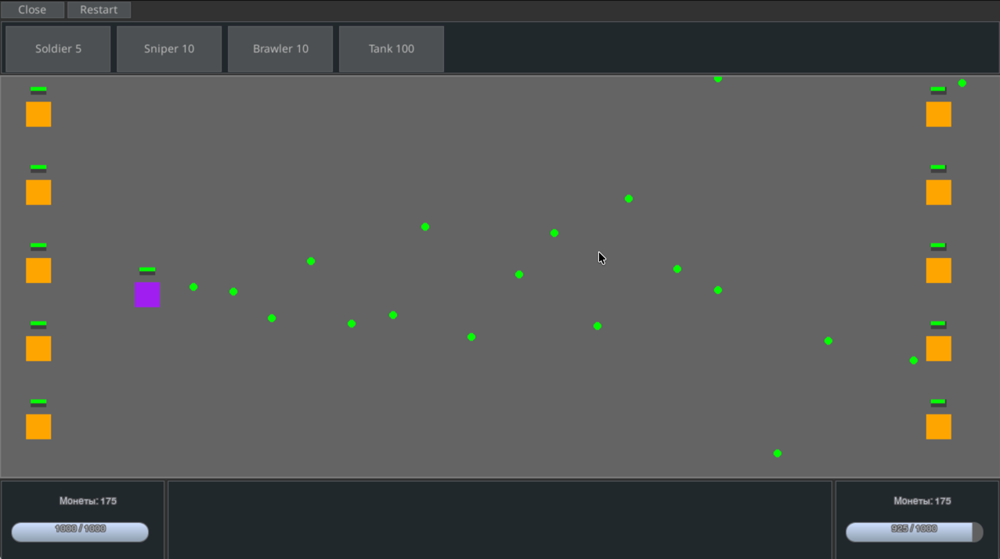

# 🎮 Massacre
> Create your own tactical battles and play!

**Massacre** — это игровой конструктор для создания тактических сражений с поддержкой кастомных юнитов, оружия и стратегий.

---

## ✨ Возможности

- 🎯 **ECS архитектура** — модульная система компонентов для гибкого создания игровых объектов
- ⚔️ **Разнообразное оружие** — снаряды, взрывчатка, лучевое оружие, ближний бой
- 🤖 **AI управление** — настраиваемое поведение юнитов
- 🎨 **Кастомные спрайты** — поддержка пользовательских изображений
- 📦 **Система префабов** — легкое создание юнитов через конфигурацию с наследованием
- 💰 **Игровая экономика** — система покупки юнитов
- 🎮 **Удобный UI** — интерфейс на базе pygame-gui
- ⌨️ **Горячие клавиши** — быстрая покупка юнитов (1-9)

---

## 🚀 Быстрый старт

### Требования
- Python 3.12+
- Poetry

### Установка

```bash
# Клонируйте репозиторий
git clone https://github.com/MrLampochka/Massacre.git
cd Massacre

# Установите зависимости
poetry install
poetry shell
```

### Запуск игры

```bash
python main.py
```

---

## 📁 Структура проекта

```
Massacre/
├── config.py            # Основная конфигурация
├── main.py             # Точка входа
│
├── assets/             # Игровые ресурсы
│   ├── config/        # Конфигурация префабов, юнитов, оружия
│   ├── images/        # Спрайты (фоны, оружие, эффекты)
│   └── sound/         # Звуковые эффекты
│
├── core/              # Игровой движок
│   ├── game.py        # Основной игровой цикл
│   ├── window.py      # Управление окном
│   ├── component.py   # Базовый компонент
│   ├── game_object.py # GameObject система
│   └── utils.py       # Утилиты (таймеры, векторы)
│
├── components/        # ECS компоненты
│   ├── attacks.py     # Система атак (projectile, ray, melee, explosive)
│   ├── weapon.py      # Компонент оружия
│   ├── health.py      # Здоровье и смерть
│   ├── movement.py    # Передвижение
│   ├── collision.py   # Обработка столкновений
│   ├── sprite.py      # Визуализация
│   ├── ai_control.py  # AI управление
│   ├── player_control.py # Управление игроком
│   ├── boundary.py    # Границы игрового поля
│   ├── bar.py         # UI полоски (здоровье, перезарядка)
│   └── money.py       # Игровая валюта
│
├── entities/          # Фабрики игровых объектов
│   ├── prefab_factory.py # Система префабов с наследованием
│   ├── players.py     # ControlledPlayer, AIPlayer
│   ├── units.py       # Создание юнитов
│   ├── towers.py      # Башни
│   └── bullets.py     # Снаряды
│
├── scenes/            # Игровые сцены
│   ├── menu.py        # Главное меню
│   └── tower_defense.py # Основная игра
│
└── gui/               # UI система
    ├── gui.py         # Главный GUI
    └── menu_button.py # Кастомные кнопки
```

---

## 🎯 Как использовать

### Создание юнита через префабы

Откройте `assets/config/prefabs.py` и добавьте новый префаб:

```python
PREFABS = {
    "sniper": {
        "extends": "default",  # Наследование от базового префаба
        "name": "Снайпер",
        "cost": 150,
        "kind": "unit",
        "components": {
            "weapon": {
                "reload_time": 2.0,
                "attack": {
                    "type": "ray",           # Лучевое оружие
                    "damage": 450,
                    "ray_length": 800,       # Дальность
                    "ray_width": 3,
                    "ray_color": (255, 0, 0),
                },
            },
            "health": {"value": 80},
            "sprite": {"color": "blue", "size": (32, 32)},
        }
    }
}
```

### Типы атак

```python
# Снаряд
"attack": {
    "type": "projectile",
    "bullet_name": "bullet",
    "damage": 25,
    "spread": 5,  # Разброс
}

# Взрывной снаряд
"attack": {
    "type": "explosive_projectile",
    "bullet_name": "grenade",
    "damage": 80,
    "explosion_radius": 100,
    "explosion_damage": 60,
}

# Лучевое оружие (пробивает врагов)
"attack": {
    "type": "ray",
    "damage": 450,
    "ray_length": 600,
    "ray_width": 4,
}

# Ближний бой
"attack": {
    "type": "melee",
    "damage": 60,
    "attack_radius": 50,
}
```

### Наследование префабов

Префабы поддерживают наследование:

```python
"default": {
    "components": {
        "health": {"value": 100},
        "movement": {"speed": 500},
    }
},

"fast_unit": {
    "extends": "default",  # Наследует всё от default
    "components": {
        "movement": {"speed": 800},  # Переопределяет скорость
        "ai_control": None,          # Убирает AI из родителя
    }
}
```

### Отключение компонентов

Чтобы убрать унаследованный компонент, установите его в `None`:

```python
"player_unit": {
    "extends": "default",
    "components": {
        "ai_control": None,  # Убирает AI управление
        "player_control": {  # Добавляет управление игроком
            "left_btn_cb": None,
            "right_btn_cb": None,
        }
    }
}
```

### Управление

- **Мышь**: Атака/перемещение юнитов
- **1-9**: Быстрая покупка первых 9 юнитов (отсортированных по цене)
- **R**: Перезапуск игры
- **ESC**: Выход

---

## 🛠️ Разработка

### Добавление нового компонента

```python
# components/my_component.py
from core.component import Component

class MyComponent(Component):
    def __init__(self, param1, param2, context=None):
        super().__init__(context)
        self.param1 = param1
        self.param2 = param2
    
    def update(self, dt: float):
        # Логика обновления каждый кадр
        pass
    
    def draw(self, screen):
        # Отрисовка (опционально)
        pass
```

Зарегистрируйте в `entities/prefab_factory.py`:

```python
COMPONENT_REGISTRY = {
    # ...existing components...
    "my_component": MyComponent,
}
```

### Создание новой сцены

```python
# scenes/my_scene.py
from core.game import Game

class MyScene(Game):
    def _set_game(self):
        # Инициализация сцены
        pass
    
    def _events(self):
        # Обработка событий
        pass
    
    def _update(self, dt: float):
        # Обновление логики
        pass
    
    def _draw(self, screen):
        # Отрисовка
        pass
```

---

## 📦 Зависимости

- **pygame-ce** (2.5.6+) — игровой движок
- **pygame-gui** (0.6.12+) — UI библиотека
- **numpy** (2.3.5+) — математические операции
- **pygbag** (0.9.2+) — экспорт в WebAssembly

Полный список в `pyproject.toml`.

---

## 🏗️ Сборка

### Desktop (PyInstaller)

```bash
poetry run pyinstaller main.py --onefile --name Massacre
```

### Web (pygbag)

```bash
poetry run pygbag build/web
```

---

## 🤝 Вклад в проект

Приветствуются pull requests! Для больших изменений сначала откройте issue для обсуждения.

---

## 📝 Лицензия

MIT License

---

## 👤 Автор

**Valentin Khakimov**
- Email: mr.lampochka.ru@gmail.com
- GitHub: [@MrLampochka](https://github.com/MrLampochka)

---

## 🎮 Скриншоты




---

**Приятной игры! 🚀**

